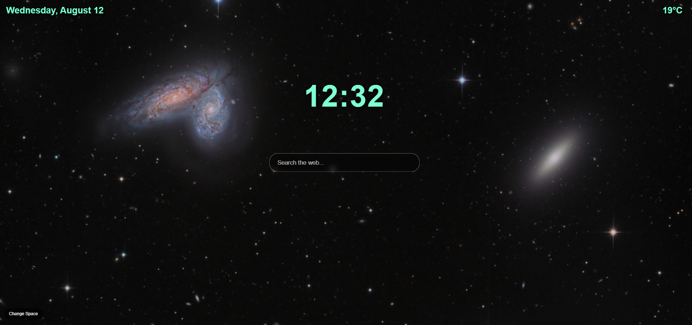

# CosmoTab



a new tab page with a space theme.

## features

* nasa apod background
* random space images with **change space**
* current time and date
* weather based on your location
* google search bar

## built with

* html
* css
* javascript
* vite
* nasa api
* open-meteo api

## live demo

[open cosmotab](https://e-lataks.github.io/CosmoTab/)

## setup

```bash
npm install
npm run dev
```

create a `.env` file and add your nasa api key:

```env
VITE_NASA_API_KEY=your_api_key
```
